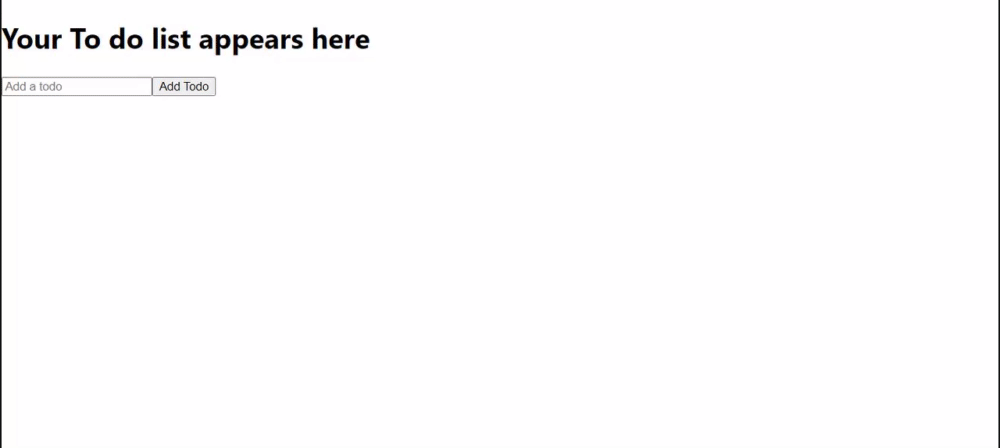

# To Do List Technical Test

To get started
1) first enter 'npm install' to install all the dependancies
2) to start the application, enter 'npm start' to boot up the development server

This is my solution for the To Do List technical test, as you can see, this was made with React.js and Hooks for state management. 

## Solution
I thought about this carefully, so I carved out 3 componenets which contain each part of the application's functionality

TodoList.js - contains all the functionality for the CRUD operations needed for the application to work as expected, then those functions are passed as props to the relevant children

TodoForm.js - just contains the form to submit the to do, which then adds to the list

Todo.js - Renders all of the todo's in the list onto the page, also contains some extra functionality to edit and remove a todo if needed

### Demo

